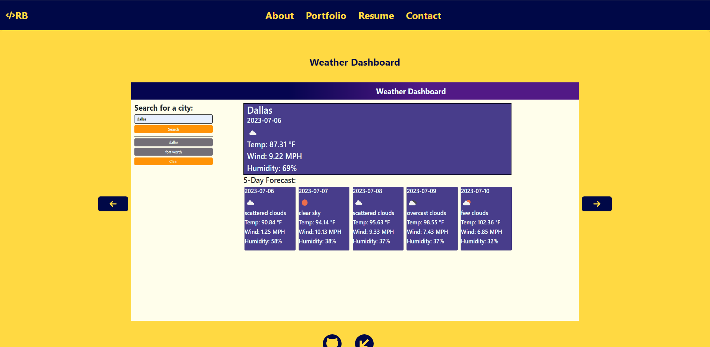

# reactPortfolio

- [Website](https://ryans-react-portfolio.netlify.app/)

## Description

This is my React Portfolio my goal was to make a web application to display who I am and the projects I'm confident in.

## Table of Contents (Optional)

- [Installation](#installation)
- [Usage](#usage)
- [Credits](#credits)
- [License](#license)

## Installation

N/A

## Usage

   

## Credits

N/A

## License

N/A

## Badges

## Features

- cards for the projects that are responsive to hovering and clicks
- links for my social platforms at the bottom of the page
- form that someone could contact me with(in the future)
- dowloadable resume

## How to Contribute

- Ryan.business.bowen@gmail.com

## Tests

N/A
